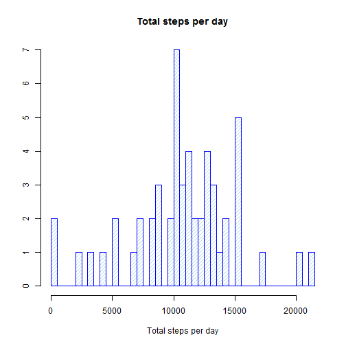
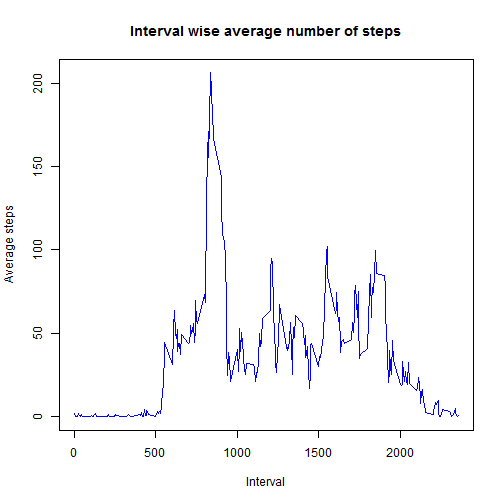
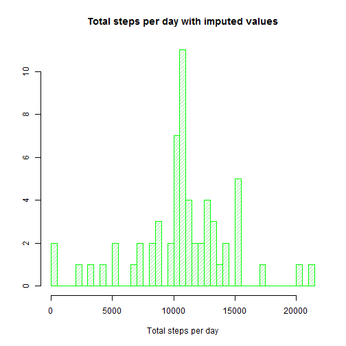
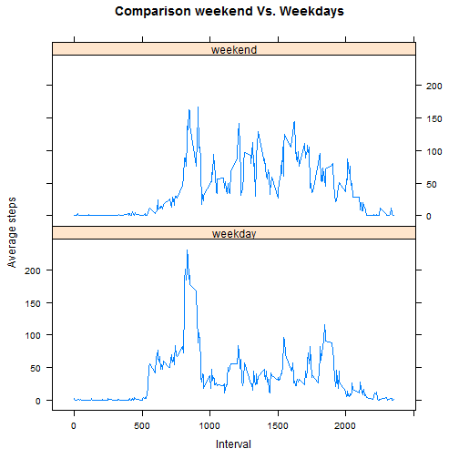

## Loading and pre-processing the data


```r
library(dplyr)
library(lubridate)
library(lattice)
data <- read.csv("repdata_data_activity/activity.csv")
#print(nrow(data))

by_date <- group_by(data, date)
plt_data <- summarise(by_date, sum(steps))
colnames(plt_data) <- c("Date", "TotalSteps")
```

## What is mean total number of steps taken per day?


```r
hist(plt_data$TotalSteps, breaks=50, col="lightblue", border="blue", density=20,
     main="Total steps per day", ylab="", xlab="Total steps per day")
```

 

```r
mean(plt_data$TotalSteps, na.rm=TRUE)
median(plt_data$TotalSteps, na.rm=TRUE)
```
- On an average (mean), the total number of steps each day was 10766.19.
- Median of the total number of steps was 10765.

## What is the average daily activity pattern?


```r
iWiseData <- data %>%
  group_by(interval) %>%
  summarise(mean(steps, na.rm=TRUE))

colnames(iWiseData) <- c("interval", "mSteps")

plot(iWiseData$interval, iWiseData$mSteps, type="l", 
     main="Interval wise average number of steps",
     xlab="Interval", ylab="Average steps", col="blue")
```

 

```r
filter(iWiseData, mSteps == max(mSteps))
```
- On an average interval number 835 contains maximum number of steps

## Imputing missing values


```r
new_Data <- subset(data, is.na(data$steps))
```
- We have 2304 rows in the given data for which "steps" variable is NA.


```r
new_Data <- data
by_intervals <- group_by(new_Data, interval)
IntervalWiseMean <- summarise(by_intervals, mean(steps, na.rm=TRUE))
colnames(IntervalWiseMean) <- c("interval", "MSteps")

nRow <- nrow(new_Data)

for (i in 1:nRow) {
  if (is.na(new_Data[i,]$steps) == TRUE)
  {     
        iMean <- filter(IntervalWiseMean, interval==new_Data[i,]$interval)
        new_Data[i,]$steps <- iMean$MSteps
  }
}

by_date <- group_by(new_Data, date)
plt_data <- summarise(by_date, sum(steps))
colnames(plt_data) <- c("Date", "TotalSteps")

hist(plt_data$TotalSteps, breaks=50, col="lightgreen", border="green", density=20,
     main="Total steps per day with imputed values", ylab="", xlab="Total steps per day")
```

 

```r
mean(plt_data$TotalSteps, na.rm=TRUE)
median(plt_data$TotalSteps, na.rm=TRUE)
```

After modifying the data to replace NA values by meaningful ones, we find that,  

- On an average (mean), the total number of steps each day was 10765.64.
- Median of the total number of steps was 10762.
- By imputing the data using mean of the intervals the values of mean and median actually decrease.

## Are there differences in activity patterns between weekdays and weekends?


```r
#Get DoW = day of week as number.
new_Data <- mutate(new_Data, DoW = wday(as.Date(date)))

# create new factor variable for weekday and weekend.
weekDaysData <- filter(new_Data, DoW >1 & DoW < 7)
weekDaysData <- mutate(weekDaysData, DoW = "weekday")


weekendData <- filter(new_Data, DoW == 1 | DoW == 7 )
weekendData <- mutate(weekendData, DoW = "weekend")

compData <- rbind(weekDaysData, weekendData)
compData <- mutate(compData, DoW = factor(DoW))

plotData <- compData %>%
            group_by(DoW,interval) %>%
            summarise(mean(steps))
colnames(plotData) <- c("DoW", "interval", "mSteps")

attach(plotData)
```

```
## The following objects are masked from compData:
## 
##     DoW, interval
```

```r
xyplot(plotData$mSteps~plotData$interval|plotData$DoW, type="l", 
             main="Comparison weekend Vs. Weekdays", 
             xlab="Interval", ylab="Average steps",
             layout=c(1,2))
```

 

```r
detach(plotData)
```

- On weekends there is more activity than weekdays in the higher numbered intervals. Assuming that higher number of interval means evening time; it suggests that subjects are more active during weekend evenings.

